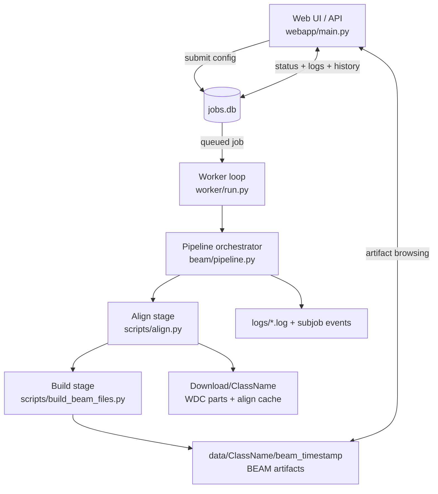
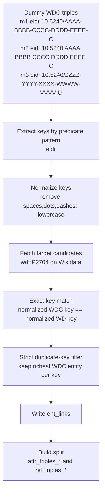

# BEAM-App

BEAM-App is a web + worker system that builds BEAM-style entity alignment datasets from WDC classes and Wikidata.

It is designed to let you:
- run reproducible benchmark generation jobs,
- inspect progress and logs from a web UI,
- produce structured outputs ready for analysis.

## Table of Contents

- [1) What BEAM Does](#1-what-beam-does)
- [2) Prerequisites](#2-prerequisites)
- [3) Quick Start (Docker)](#3-quick-start-docker)
- [4) Health Check + First Successful Run](#4-health-check--first-successful-run)
- [5) Pipeline Walkthrough (Visual + Concrete)](#5-pipeline-walkthrough-visual--concrete)
- [6) Repository Map](#6-repository-map)
- [7) How to Modify Safely](#7-how-to-modify-safely)
- [8) Common Failures and Fixes](#8-common-failures-and-fixes)
- [9) Documentation by Task](#9-documentation-by-task)

## 1) What BEAM Does

Input:
- a WDC class (for example `Movie`, `City`, `Language`),
- matching configuration (predicate pattern, mapping rules, target class/property),
- optional filters and normalization rules.

Pipeline output:
- linked entity pairs (`ent_links`),
- graph slices (`attr_triples_*`, `rel_triples_*`),
- property stats and metadata,
- build artifacts under `data/<ClassName>/beam_<timestamp>/...`.

## 2) Prerequisites

Required:
- Docker Engine + Docker Compose
- Outbound network access (WDC + Wikidata endpoints)

Recommended:
- large disk capacity (WDC parts and caches grow quickly)
- monitor free space regularly (`Download/` is usually the biggest directory)

## 3) Quick Start (Docker)

```bash
git clone <your-repo-url> BEAM-App
cd BEAM-App
docker compose up -d --build
```

Open:
- `http://localhost:8501`
- or from another machine: `http://<server-ip-or-domain>:8501`

Stop:

```bash
docker compose down
```

## 4) Health Check + First Successful Run

Health check:

```bash
docker compose ps
docker compose exec webapp bash scripts/check_health.sh
```

Expected:
- `webapp` container is `healthy`
- `worker` container is `Up`
- HTTP check is reachable

First successful run (UI):
1. Open `http://localhost:8501`.
2. Pick a small class/preset.
3. Start a job.
4. Confirm status flow: `queued -> running -> done`.
5. Confirm build artifacts are created under `data/...`.

## 5) Pipeline Walkthrough (Visual + Concrete)

### 5.1 Input: a real job config

Typical UI configuration for a first run:
- `Matching mode`: `property`
- `Class name`: `Movie`
- `Pattern search scope`: `predicate`
- `WDC pattern`: `eidr`
- `Property mapping rules`: `eidr => wdt:P2704`
- `Target endpoint`: `wikidata`
- `Target class filter`: `Q11424`
- `Parts to process`: `1-3` (small first run)

This means: extract WDC values from predicates matching `eidr`, then align them against Wikidata property `P2704` (EIDR) for entities in class `Q11424` (film).

### 5.2 Visual pipeline



### 5.3 Visual processing pipeline (algorithms on dummy data)



Dummy data walkthrough:
- Source keys before normalization:
  - `m1`: `10.5240/AAAA-BBBB-CCCC-DDDD-EEEE-C`
  - `m2`: `10 5240 AAAA BBBB CCCC DDDD EEEE C`
  - `m3`: `10.5240/ZZZZ-YYYY-XXXX-WWWW-VVVV-U`
- After normalization (`ignore_chars=spaces;-;.` + lowercase):
  - `m1` -> `105240/aaaabbbbccccddddeeeec`
  - `m2` -> `105240/aaaabbbbccccddddeeeec`
  - `m3` -> `105240/zzzzyyyyxxxxwwwwvvvvu`
- Candidate matches from target:
  - `105240/aaaabbbbccccddddeeeec` -> `wd:Q111`
  - `105240/zzzzyyyyxxxxwwwwvvvvu` -> `wd:Q222`
- Duplicate-key resolution:
  - `m1` and `m2` share same key; strict filter keeps only one (richest record).
- Final links written:

```text
<m1> <wd:Q111>
<m3> <wd:Q222>
```

Algorithm-to-output mapping:
- key extraction + normalization + matching + dedup -> `ent_links`
- WDC graph split after links -> `attr_triples_1`, `rel_triples_1`
- target-side expansion -> `attr_triples_2`, `rel_triples_2`
- aggregate counters -> `stats.json`

### 5.4 What happens at runtime

1. UI posts your form config.
2. Config is stored as a job in `jobs.db` with status `queued`.
3. Worker picks it, marks `running`, and executes the pipeline.
4. Align stage:
   - ensures class parts exist in `Download/<ClassName>/` (download/decompress if missing),
   - extracts candidate values from WDC quads,
   - resolves target-side candidates via endpoint queries.
5. Build stage writes benchmark artifacts under `data/<ClassName>/beam_<timestamp>/`.
6. Job ends in `done` or `error`; UI shows subjob states, logs, and output paths.

### 5.5 Happy-path sample (what success looks like)

Status flow in UI:
- `queued -> running -> done`
- subjobs: `align: done`, `build: done`

Output tree sample:

```text
data/Movie/beam_20260511_104512/
  ent_links
  attr_triples_1
  rel_triples_1
  fold_0/
  fold_1/
  stats.json
  BUILD_CONFIG.json
```

Sample content snippets:

```text
# ent_links
<wdc_entity_iri_1> <wd:Q12345>
<wdc_entity_iri_2> <wd:Q67890>
```

```text
# attr_triples_1
<wdc_entity_iri_1> <attr_name> "Example Title"
<wdc_entity_iri_1> <attr_datePublished> "2019-01-01"
```

```text
# rel_triples_1
<wdc_entity_iri_1> <rel_director> <wdc_entity_iri_55>
<wdc_entity_iri_1> <rel_actor> <wdc_entity_iri_77>
```

How to read them quickly:
- `ent_links`: final aligned pairs (source entity -> target entity).
- `attr_triples_*`: literal attributes used for benchmark features.
- `rel_triples_*`: relation edges between entities.
- `stats.json`: aggregate counts/metrics for sanity checks.
- `BUILD_CONFIG.json`: exact parameters used for reproducibility.

### 5.6 Failure sample + recovery (fast debug path)

Example failure:
- UI job ends `error` during `align`.
- Message pattern: missing parts, connection refused, incomplete download, or zero matches.

Check sequence:

```bash
docker compose logs --tail=300 worker
docker compose exec webapp bash scripts/check_health.sh
du -sh Download data
```

Common causes and next action:
- Network interruption while downloading WDC parts:
  - rerun job with same config (download resumes from existing local state when possible).
- `No WDC values matched the property mapping rules`:
  - broaden pattern scope (`predicate` vs `value`) or adjust mapping rule/property.
- Job stuck `queued`:
  - verify worker is alive (`docker compose ps`, worker logs).

## 6) Repository Map

Core code:
- `webapp/main.py`: FastAPI UI/API/WebSocket layer
- `worker/run.py`: job execution loop
- `beam/pipeline.py`: orchestration and error handling
- `scripts/align.py`: matching and endpoint querying
- `scripts/build_beam_files.py`: BEAM artifact generation

Operational docs:
- `docs/admin/` for deployment/operations
- `docs/algorithms/` for processing details
- `docs/dev/` for code modification guidance

## 7) How to Modify Safely

Typical changes:
- UI behavior: `webapp/templates/` + `webapp/main.py`
- job execution behavior: `worker/run.py` + `beam/pipeline.py`
- matching logic: `scripts/align.py`
- output format/generation: `scripts/build_beam_files.py`

Validation checklist after code changes:

```bash
docker compose up -d --build
docker compose exec webapp bash scripts/check_health.sh
pytest -q
```

If the change touches pipeline/output behavior, also run one real job and verify produced artifacts.

## 8) Common Failures and Fixes

`webapp not reachable`:

```bash
docker compose ps
docker compose logs --tail=200 webapp
```

`jobs remain queued`:

```bash
docker compose logs --tail=300 worker
```

`downloads or align fail intermittently`:
- check outbound network connectivity to WDC/Wikidata
- inspect worker logs for retry/fetch errors

`disk pressure / sudden failures`:

```bash
du -sh Download data data-old
```

Then clean old heavy artifacts if needed.

`stale local PID warnings` (if seen outside Docker tooling):
- prefer Docker health/status as source of truth:

```bash
docker compose ps
docker compose exec webapp bash scripts/check_health.sh
```

## 9) Documentation by Task

- Global index: [docs/README.md](docs/README.md)
- Architecture: [docs/admin/architecture.md](docs/admin/architecture.md)
- Docker deployment: [docs/admin/docker_deploy.md](docs/admin/docker_deploy.md)
- Setup/install/run: [docs/admin/setup_install_run.md](docs/admin/setup_install_run.md)
- Operations: [docs/admin/operations.md](docs/admin/operations.md)
- Troubleshooting: [docs/admin/troubleshooting.md](docs/admin/troubleshooting.md)
- End-to-end processing: [docs/algorithms/pipeline_end_to_end.md](docs/algorithms/pipeline_end_to_end.md)
- Developer workflow: [docs/dev/how_to_modify_code.md](docs/dev/how_to_modify_code.md)
- User tutorial: [docs/user/tutorial.md](docs/user/tutorial.md)
- Limits and caveats: [docs/limits.md](docs/limits.md)

In-app tutorial page:
- `/tutorial`
